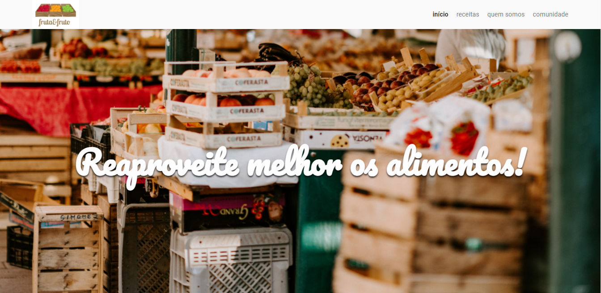

# Fruta e Fruto - Arquitetura CSS

  

## Um pouco do Projeto:

➡ Uma landing page responsiva semelhante ao projeto [Fruta e Fruto - Bootstrap](https://github.com/glsvitoria/frutas-frutos-bootstrap), porém o outro projeto foi feito utilizando o framework Bootstrap e esse aqui foi focado na arquitetura CSS utilizando o BEM - Block Element Modifier para organizar o estilo CSS
➡ Site feito no curso da Alura de Arquitetura CSS: Descomplicando os problemas da formação Front-End

## Conteúdos

- [Overview](#overview)
  - [Como rodar o projeto](#como-rodar-o-projeto)
  - [Como utilizar](#como-utilizar-o-projeto)
  - [Screenshot](#screenshot)
  - [Links](#links)
- [Processo](#processo)
  - [Tecnologia utilizadas](#tecnologias-utilizadas)
  - [O que eu aprendi](#oque-eu-aprendi)
  - [Continuação do desenvolvimento](#continuacao-do-desenvolvimento)
- [Autor](#autor)

## Overview

### Como rodar o projeto

 1. Primeiramente é necessário ter o node js instalado(caso não tenha, apenas baixe a pasta zip do projeto) 
 2. Clone o projeto com `git clone https://github.com/glsvitoria/fruta-fruto-arquitetura-css`
 3. Após clonar o projeto, basta apenas abrir o html principal do site e utilizar as suas funcionalidades

### Como utilizar

 1. Se trata apenas de uma landing page de uma fictícia empresa que posta receitas online
 2. Não apresenta nenhuma funcionalidade a mais, apenas utilizado para o exercício de uma nova forma de arquitetar os estilos CSS no projeto

### Screenshot

### Links
- Site hospedado: [Fruta e Fruto](link)

## Processo

### Tecnologias utilizadas:

### O que eu aprendi
 - Utilização da técnica BEM - Block Elemento Modifier (Bloco Elemento Modificador) para a organização dos estilos CSS(ex: bloco__elemento, bloco--modificador, bloco__elemento--modificador)
 - Técnica que foca na possibilidade de alteração do CSS e com a separação bem extrema dos arquivos de estilo você consegue ir diretamente no estilo do elemento desejado e trocar
 - Evita a criação de uma página CSS com centenas de linhas e precisar ficar buscando determinado elemento
 - Porém é preciso ter muito cuidado para todos os estilos estarem batendo certinho e não se chocando nesses momentos de separação entre as classes de cada um e também na hora de usar as media querys

### Continuação do desenvolvimento
 - Um projeto apenas com o objetivo de exercitar um nova técnica, dessa forma não pretendo acrescentar nenhuma funcionalidade extra no site

## Autor
- Linkedin - [Guilherme Vitória](https://www.linkedin.com/in/glsvitoria/)
- GitHub - [glsvitoria](https://github.com/glsvitoria)
- Instagram - [glsvitoria](https://www.instagram.com/glsvitoria/)
